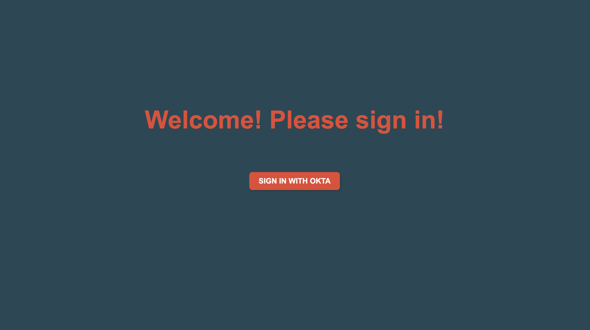
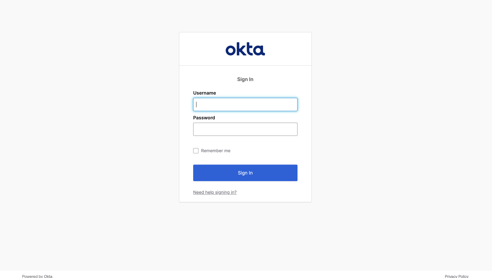
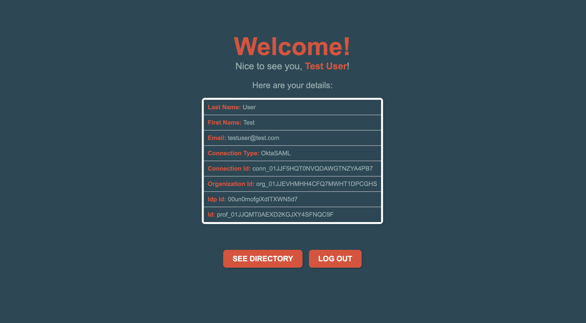
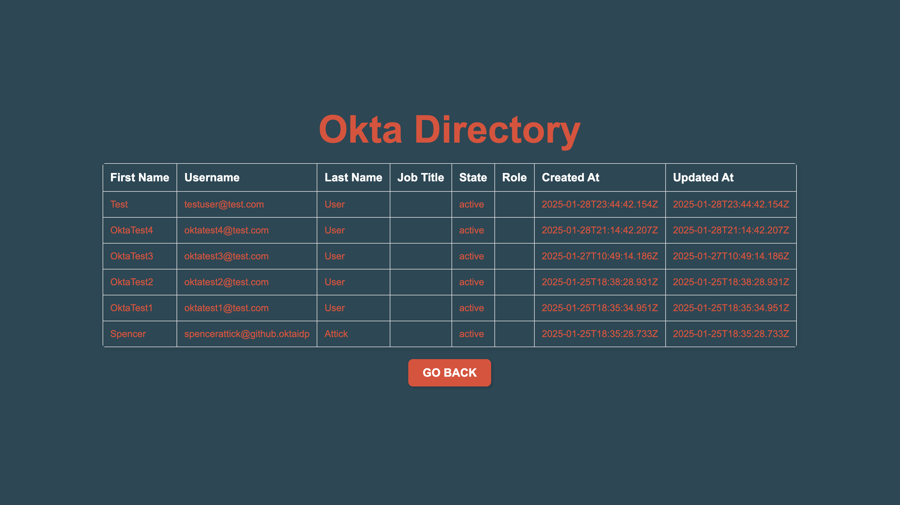

# WorkOS SSO and Directory Sync (Okta)
This project is a [Next.js](https://nextjs.org/) app that uses [WorkOS's](https://workos.com/) [SSO](https://workos.com/docs/sso) and [Directory Sync](https://workos.com/docs/directory-sync) features. It leverages [Okta](https://www.okta.com/) to log users in with SSO and create a connection between WorkOS and Okta through Directory Sync.

## Instructions for Deployed App
The project is deployed here: [workos-demo-ashen.vercel.app](workos-demo-ashen.vercel.app
) deployed through [Vercel](http://vercel.com/).

To use it, follow these steps:
1. Click the `Sign in with Okta` button
2. Use these test credentials to sign in:

    username: `testuser@test.com`

    password: `supersecret1234`
3. View the Directory Sync list by clicking `See Directory`

## App Views

## Instructions for localhost
1. Clone the GitHub repository:

    ` $ git clone https://github.com/spencerattick/workos-demo.git`
2. Navigate into the project:

    `$ cd workos-demo`
3. Install the dependancies

    `$ npm install`
4. Create an environment file at the top level of the file tree

     `$ touch .env`
5. Add in two key/value pairs to the `.env` file:

    `WORKOS_API_KEY` and `WORKOS_CLIENT_ID`

    Ask Spencer to securely share these values with you.
6. In your browser, navigate to `http://localhost:3000/`.

7. Click `Sign in with Okta`

8. Sign in using these credentials:

    username: `testuser@test.com`

    password: `supersecret1234`

9. View the Directory Sync list by clicking `See Directory`

